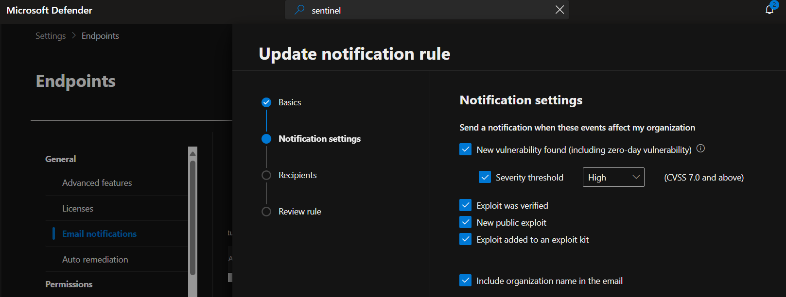

# Configure alert and vulnerability notification rules

Alert and vulnerability rules can be configured by Administrator roles, such as Security Administrator.
Principle of least privileges must be followed, avoid using Global Admin where possible.

Path: Defender > Settings > Endpoints > Email Notifications

> Vulnerabilities notifications → for 0 days and acknowledged CVEs

* Low targets any CVSS score
* Medium 4.0 and above
* High 7.0 and above
* Critical 9.0 and above

> Alerts notifications → for malware detections

Emails are then sent to the recipients whenever any of the specified settings are met.

Test: Let's launch our own VM in Azure. RDP into it then make sure it is onboarded in Defender for Endpoint.

Next, we want to download the EICAR anti-malware test file to help us generate some alerts in Defender.

If everything goes well Defender should trigger, let's verify this quickly with PowerShell `Get-MpThreatDetection`

<pre lang="markdown"> 
ActionSuccess                  : True
AdditionalActionsBitMask       : 0
AMProductVersion               : 4.18.25050.5
CleaningActionID               : 3
CurrentThreatExecutionStatusID : 0
DetectionID                    : {639AF303-3652-487F-92E9-880F70A7B310}
DetectionSourceTypeID          : 4
DomainUser                     : placeholder\yoan.famel
InitialDetectionTime           : 7/13/2025 4:37:40 PM
LastThreatStatusChangeTime     : 7/13/2025 4:37:45 PM
ProcessName                    : Unknown
RemediationTime                : 7/13/2025 4:37:45 PM
Resources                      : {file:_C:\Users\yoan.famel\Downloads\eicar_com.zip, webfile:_C:\Users\yoan.famel\Downl
                                 oads\eicar_com.zip|https://secure.eicar.org/eicar_com.zip|pid:8704,ProcessStart:133968
                                 982602127182}
ThreatID                       : 17463
ThreatStatusErrorCode          : 0
ThreatStatusID                 : 4
PSComputerName                 :
</pre>

And indeed going back to our alerts we see some traffic and we get notified.

